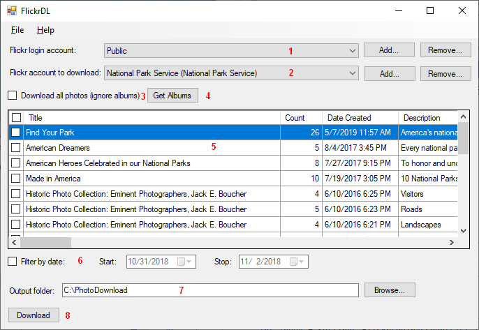
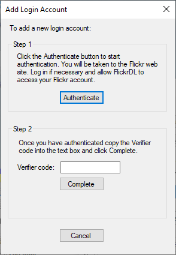

[FlickrDL](https://github.com/dmcclimans/FlickrDL)
==========

FlickrDL is a Windows application that can download photos with selected metadata from a
Flickr account.

## Contents
* [Features](#features)
* [Requirements](#requirements)
* [Installation](#installation)
* [Usage](#usage)
* [Authentication](#authentication)
* [SQLite Database](#SQLiteDatabase)
* [License](#license)

## Features
* Downloads photos with selected metadata from a Flickr account or from selected albums in
  an account.
* Saves the Title as the IPTC Title.
* Saves the Description as the IPTC Caption.
* Saves the Tags as IPTC Keywords.
* Sets the file modified date to the date the photo was taken.
* Automatically renames photos when required to avoid duplicate names.
* When downloading from albums, creates a separate folder for each album.

## Requirements
* Requires Windows 7 or later.

## Installation
* Go to the FlickrDL
  [latest release](https://github.com/dmcclimans/FlickrDL/releases/latest)
  page and download `FlickrDL_x.y.zip` (where x.y is the version number).

* There is no install program.
  Unzip the files into a folder, and run `FlickrDL.exe`.

## Usage

1. The **Login account** is the account that you will be logged in as when you perform the
search and download.
Select **Public** to search without logging in (which will retrieve only photos that are
visible to the public.

    To search as a logged in user, you must add a login account. This will require you to
    authenticate the account. See the [Authentication](#authentication) section below.

2. The **Download account** is the account to search and download.
You can add any account where you know the account name or email address.

3. Check the **Download all photos** checkbox to download all photos from the download
account.

    This only works with accounts that have fewer than 4000 photos. For accounts that have
    more than 4000 photos, you must break the search into smaller pieces using the **Filter
    by date** option, or download by album.

4. Click the **Get Albums** button to retrieve the list of albums for the download account.

5. The **Album list** shows the albums retrieved by the **Get Albums** button. Select
the albums that you wish to process. You can click on the column headers to sort the
albums by name or other property.

6. Use the **Filter by date** option to select a subset of photos that were taken during
the specified date range.

7. Specify the path of the **Output Folder**.

    If you download by album, FlickDL will create a subfolder for each album name under
    the **Output Folder**.

    If you download all photos, all the photos will be stored in the **Output Folder**.

8. Click the **Download** button to download the files.

## Authentication

To add a **Login account**, you must "Authenticate" the FlickrDL application with
that account. This process tells Flickr to allow FlickrDL to access the account.
You must be logged in to the account to be able to authenticate.

FlickrDL will make any changes to your account, since it requests only **read** access to
your account.

To authenticate:

1. In your browser, log into the Flickr account that you wish to add as your login
account.

2. In FlickrDL, click the **Add** button to add a login account.

3. You will see the Add Login Account dialog:

4. Click the Authenticate button.

5. Your browser will open a new window or tab displaying a Flick Page asking you to
authorize FlickrDL to access your account.

    Click **OK, I'll authorize it** button.

6. Flickr will display another page showing the 9-digit authorization code. Copy and paste
this code into the **Verifier code** text box in FlickrDL.

7. Click the **Complete** button.

8. Close the Add Login Account dialog.

## License
FlickrDL is licensed under the MIT license. You may use the FlickrDL application in any
way you like. You may copy, distribute and modify the FlickrDL software provided you
include the copyright notice and license in all copies of the software.

FlickrDL links to libraries that are licensed under the Apache License or under a custom
license which permits use and redistribution.

FlickrDL uses, but does not link to, the program exiftool.exe. ExifTool is licensed under
the GNU General Public License (GPL) or the Artistic License. You may use the software in
any way you like. You may copy, distribute and modify the exiftool software as long as you
make the source code available.

See the [License.txt](License.txt) file for additional information.

